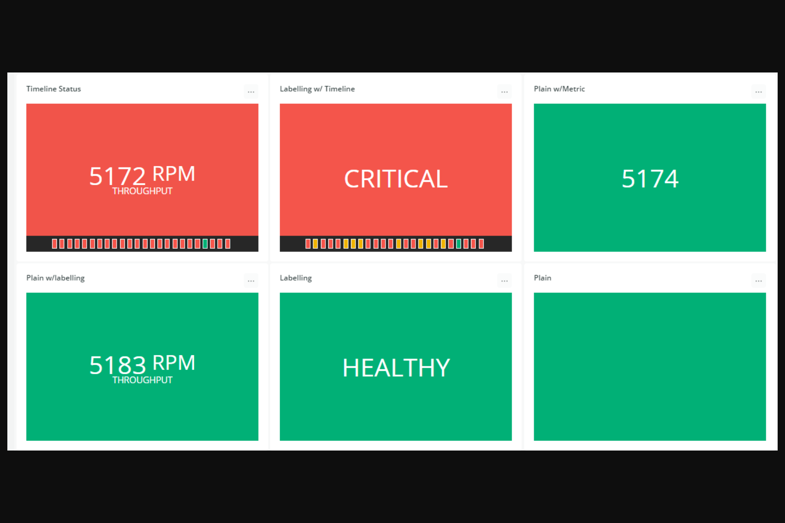
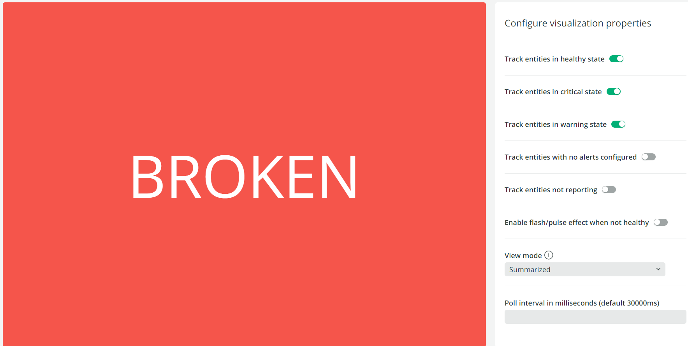
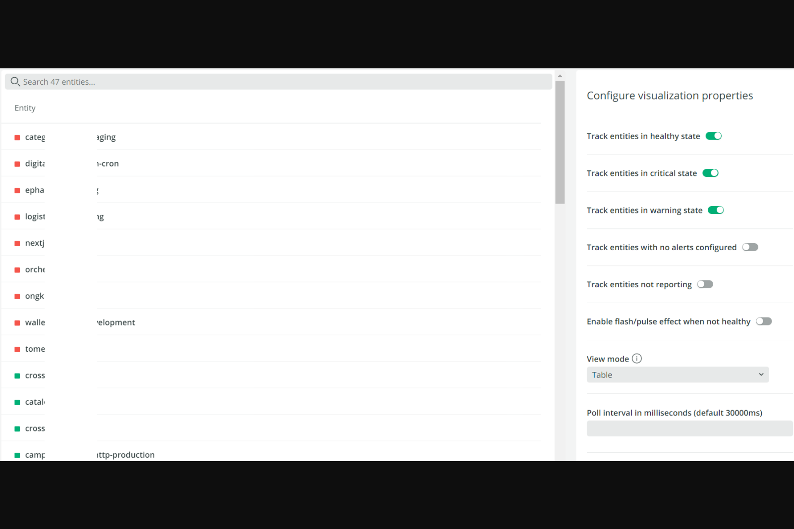

[](https://opensource.newrelic.com/oss-category/#new-relic-experimental)

# Status Widget Pack

This nerdpack contains two status widget custom visualizations to be used with dashboards.
- NRQL Status Widget (Configurable variations)
- Entity Status Widget (2 modes: Summary & Table)

## NRQL Status Widget




## NRQL Widget Features

- Custom labelling for critical, warning, healthy
- Metric suffixes and labels
- Timeline
- Togglability for all features
- Regex matching for string values
- Configurable OnClick actions to url or Modal
- Modal can be provided any number of additional NRQL queries to be displayed
- Toggle flash/pulse effect
- Define bottom left and right metrics
---
## Entity Status Widget

### Summary


### Table


## Entity Widget Features

- Track specific alerting states
- Set custom labels
- Provides a summary and table view mode
- Toggle flash/pulse effect
- Define custom entity search query
- Define specific entity guids
---
## Open source license

This project is distributed under the [Apache 2 license](LICENSE).


## Getting started

> Include a step-by-step procedure on how to get your app installed and deployed. The clone and deploy steps are similar across all apps. If your app has additional steps required to get started, include them here or in their own section.

1. Ensure that you have [Git](https://git-scm.com/book/en/v2/Getting-Started-Installing-Git) and [NPM](https://www.npmjs.com/get-npm) installed. If you're unsure whether you have one or both of them installed, run the following commands. (If you have them installed, these commands return a version number; if not, the commands aren't recognized.)
```bash
git --version
npm -v
```
2. Install the [NR1 CLI](https://one.newrelic.com/launcher/developer-center.launcher) by going to [the developer center](https://one.newrelic.com/launcher/developer-center.launcher), and following the instructions to install and set up your New Relic development environment. This should take about 5 minutes.
3. Execute the following command to clone this repository and run the code locally against your New Relic data:

```bash
nr1 nerdpack:clone -r https://github.com/newrelic/nr1-status-widgets.git
cd nr1-status-widgets
nr1 nerdpack:serve
```

Visit [https://one.newrelic.com/?nerdpacks=local](https://one.newrelic.com/?nerdpacks=local) to launch your app locally.

## Deploying this Nerdpack

> Include the necessary steps to deploy your app. Generally, you shouldn't need to change any of these steps.

Open a command prompt in the app's directory and run the following commands.

```bash
# If you need to create a new uuid for the account to which you're deploying this app, use the following
# nr1 nerdpack:uuid -g [--profile=your_profile_name]
# to see a list of APIkeys / profiles available in your development environment, run nr1 credentials:list
nr1 nerdpack:publish [--profile=your_profile_name]
nr1 nerdpack:deploy [-c [DEV|BETA|STABLE]] [--profile=your_profile_name]
nr1 nerdpack:subscribe [-c [DEV|BETA|STABLE]] [--profile=your_profile_name]
```

Visit [https://one.newrelic.com](https://one.newrelic.com), and launch your app in New Relic.

# Support

New Relic has open-sourced this project. This project is provided AS-IS WITHOUT WARRANTY OR DEDICATED SUPPORT. Issues and contributions should be reported to the project here on GitHub.

We encourage you to bring your experiences and questions to the [Explorers Hub](https://discuss.newrelic.com) where our community members collaborate on solutions and new ideas.

## Community

> Work with the Explorer's Hub team to create a tag for your app, then update the link below.

New Relic hosts and moderates an online forum where customers can interact with New Relic employees as well as other customers to get help and share best practices. Like all official New Relic open source projects, there's a related Community topic in the New Relic Explorers Hub. You can find this project's topic/threads here:

https://discuss.newrelic.com/t/nr1-status-widgets
*(Note: This URL is subject to change before GA)*

## Issues / enhancement requests

Issues and enhancement requests can be submitted in the [Issues tab of this repository](../../issues). Please search for and review the existing open issues before submitting a new issue.

## Security

As noted in our [security policy](https://github.com/newrelic/nr1-status-widget/security/policy), New Relic is committed to the privacy and security of our customers and their data. We believe that providing coordinated disclosure by security researchers and engaging with the security community are important means to achieve our security goals.

If you believe you have found a security vulnerability in this project or any of New Relic's products or websites, we welcome and greatly appreciate you reporting it to New Relic through [HackerOne](https://hackerone.com/newrelic).

# Contributing

> Work with the Open Source Office to update the email alias below.

Contributions are encouraged! If you submit an enhancement request, we'll invite you to contribute the change yourself. Please review our [Contributors Guide](CONTRIBUTING.md).

Keep in mind that when you submit your pull request, you'll need to sign the CLA via the click-through using CLA-Assistant. If you'd like to execute our corporate CLA, or if you have any questions, please drop us an email at opensource+statuswidgets@newrelic.com.
