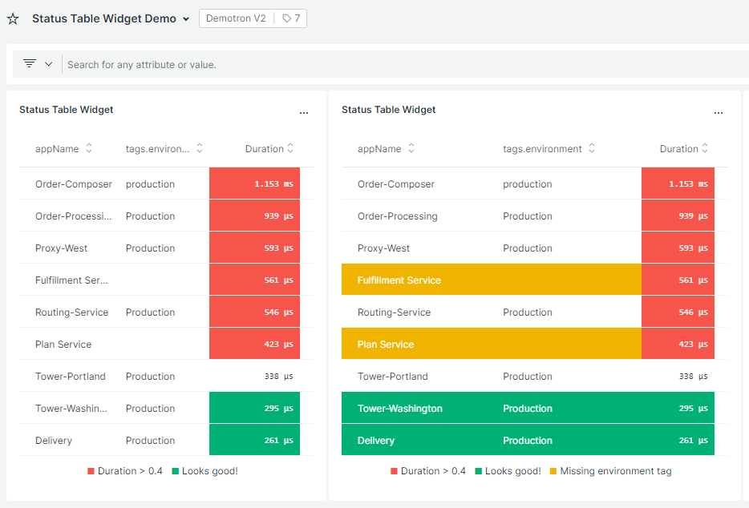
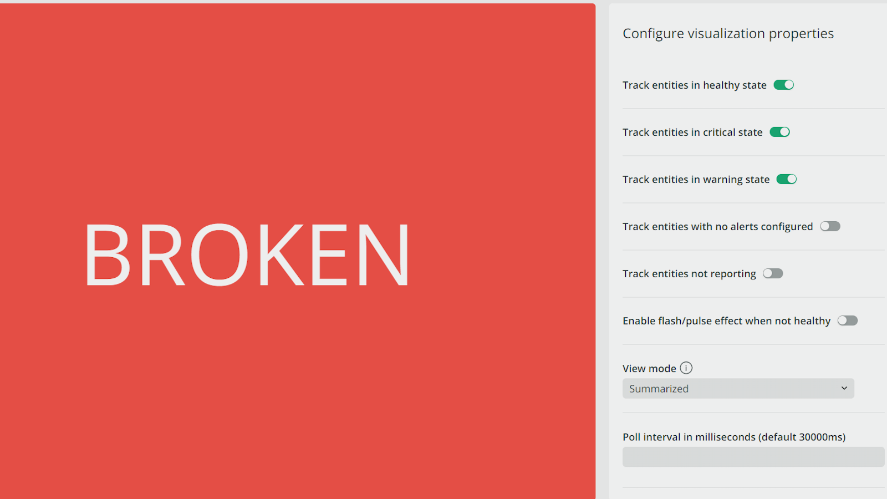
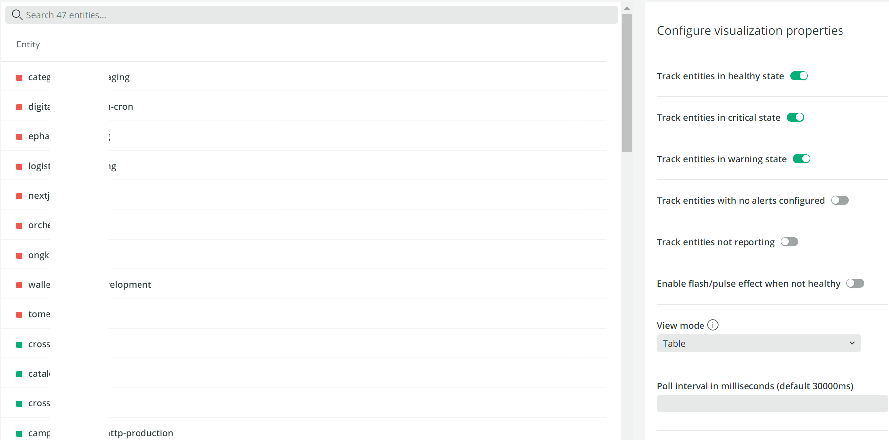

# Status Widget Pack

This nerdpack contains three status widget custom visualizations to be used with dashboards.
- NRQL Status Widget (Configurable variations)
- NRQL Status Timeline Widget
- NRQL Status Table Widget
- Entity Status Widget (2 modes: Summary & Table)

## NRQL Status Widget Features

- Custom labelling for critical, warning, healthy
- Metric suffixes and labels
- Timeline
- Togglability for all features
- Regex matching for string values
- Configurable OnClick actions to url or Modal
- Modal can be provided any number of additional NRQL queries to be displayed
- Toggle flash/pulse effect
- Define bottom left and right metrics
---
## NRQL Status Table Widget

## NRQL Status Table Widget Features
- Custom thresholds
  - Configurable background and font colors
  - Highlight just the cell or the full row
- Sortable
- Toggle Keys
- Handle 0, undefined, null cases
- Customizable table
  - Headers
  - Metric cells
---
## NRQL Status Timeline Widget

## NRQL Status Timeline Widget Features
Example query: `FROM Transaction SELECT count(*) FACET appName, hourOf(timestamp) ORDER BY timestamp LIMIT MAX`

- Custom thresholds
  - Configurable background and font colors
- Toggle Key
- Toggle Metrics
- Set decimal places
---
## Entity Status Widget

### Summary

### Table

## Entity Widget Features

- Track specific alerting states
- Set custom labels
- Provides a summary and table view mode
- Toggle flash/pulse effect
- Define custom entity search query
- Define specific entity guids
- Set custom display values
- On click to stacked entity or modal to many entities
---
# Enabling this Nerdpack

This pack of visualizations is available via the New Relic Catalog. 

To enable it in your account, go to `Add Data > Apps and Visualzations` and search for "Status Widget Pack". Click the card and subscribe this to your accounts.

Once subscribed you can browse to `Apps -> Custom Visualizations` to [add any of the widgets to a dashboard](https://docs.newrelic.com/docs/query-your-data/explore-query-data/dashboards/add-custom-visualizations-your-dashboards/).

#### Manual Deployment
If you need to customize the widgets in this pack, you can fork the code base and follow the instructions on how to [Customize a Nerdpack](https://developer.newrelic.com/build-apps/customize-nerdpack). If you have a change you feel everyone can benefit from, [please submit a PR](#contrib)!

# Support

This project is actively maintained by the New Relic Labs team. Connect with us directly by [creating issues](../../issues) or [asking questions in the discussions section](../../discussions) of this repo.

We also encourage you to bring your experiences and questions to the [Explorers Hub](https://discuss.newrelic.com) where our community members collaborate on solutions and new ideas.

New Relic has open-sourced this project, which is provided AS-IS WITHOUT WARRANTY OR DEDICATED SUPPORT.

# Security

As noted in our [security policy](https://github.com/newrelic/nr1-status-widget/security/policy), New Relic is committed to the privacy and security of our customers and their data. We believe that providing coordinated disclosure by security researchers and engaging with the security community are important means to achieve our security goals.

If you believe you have found a security vulnerability in this project or any of New Relic's products or websites, we welcome and greatly appreciate you reporting it to New Relic through [HackerOne](https://hackerone.com/newrelic).

# Contributing

Contributions are encouraged! If you submit an enhancement request, we'll invite you to contribute the change yourself. Please review our [Contributors Guide](CONTRIBUTING.md).

Keep in mind that when you submit your pull request, you'll need to sign the CLA via the click-through using CLA-Assistant. If you'd like to execute our corporate CLA, or if you have any questions, please drop us an email at opensource+statuswidgets@newrelic.com.

# Open source license

This project is distributed under the [Apache 2 license](LICENSE).

